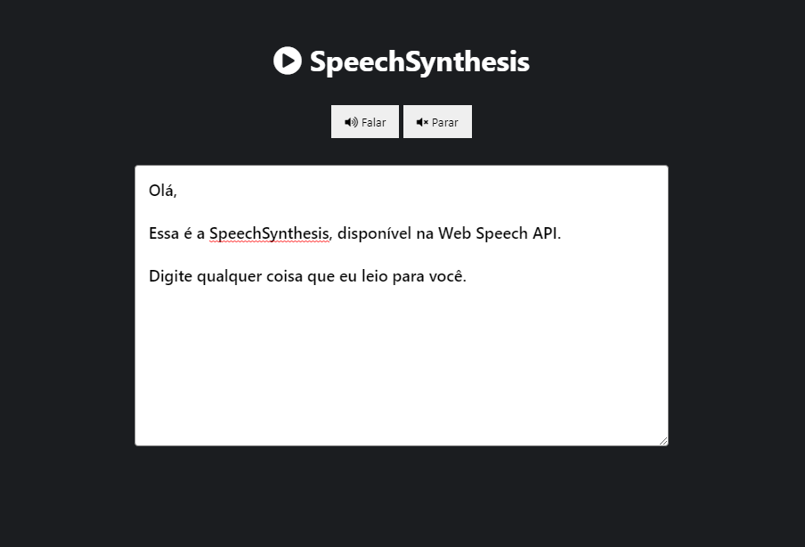

<h1 align='center'>SpeechSynthesis</h1>

🎧 Aplicação simples utilizando a API Web Speech para transformar textos em fala.

 

# 🖼 Layout

---

<h3>📝 Licença</h3>

O projeto se encontra sob licença MIT. Para mais detalhes, acesse <a href='LICENSE'>license<a>.

Criado com 💙 por <a href='https://github.com/rafaasimi/' target='blank'>Rafael Simionato</a>

